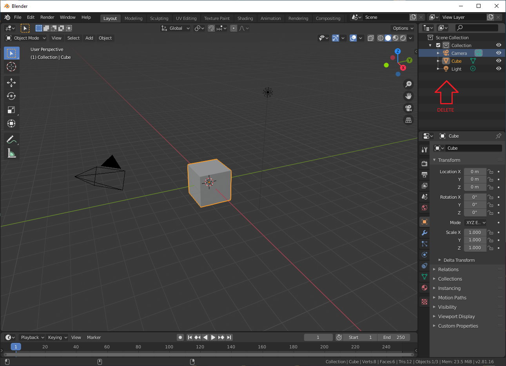
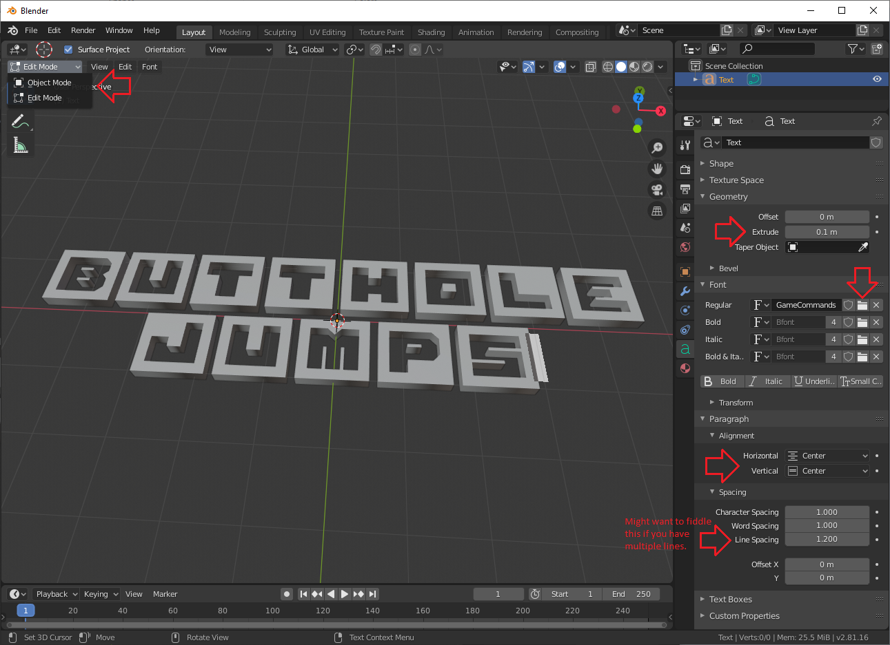
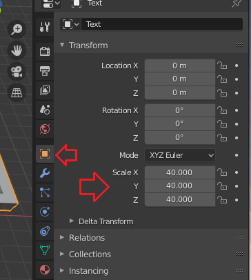
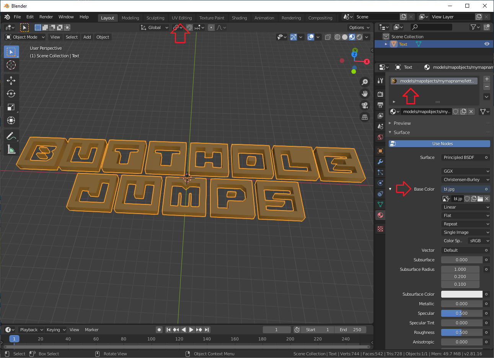
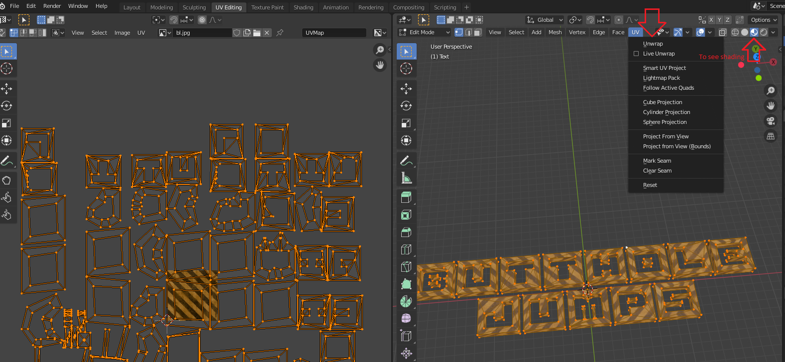
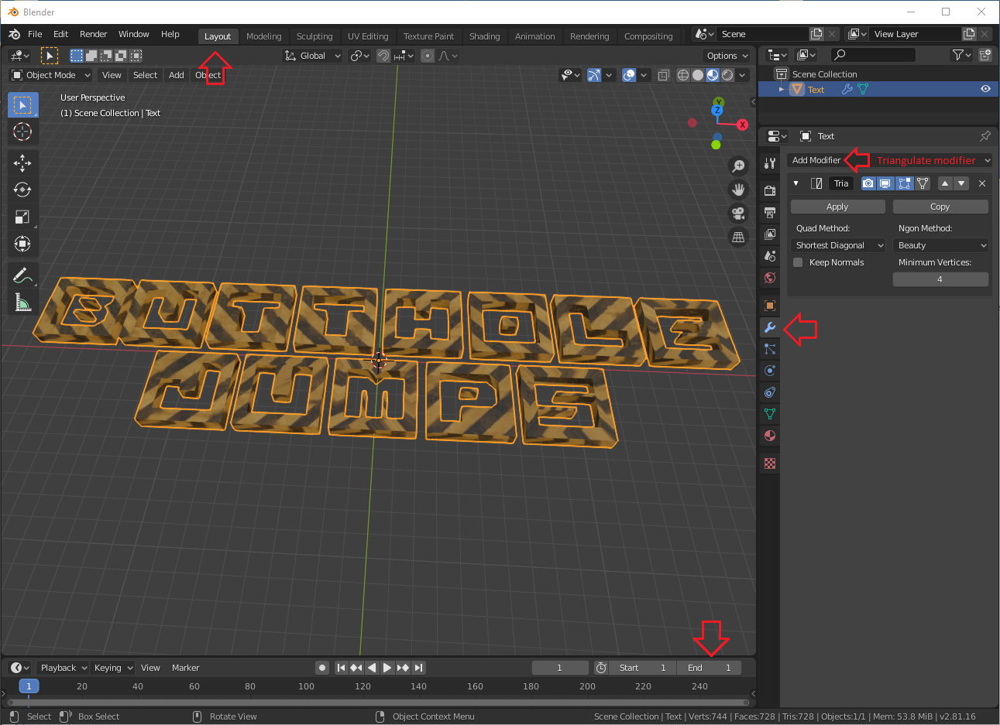
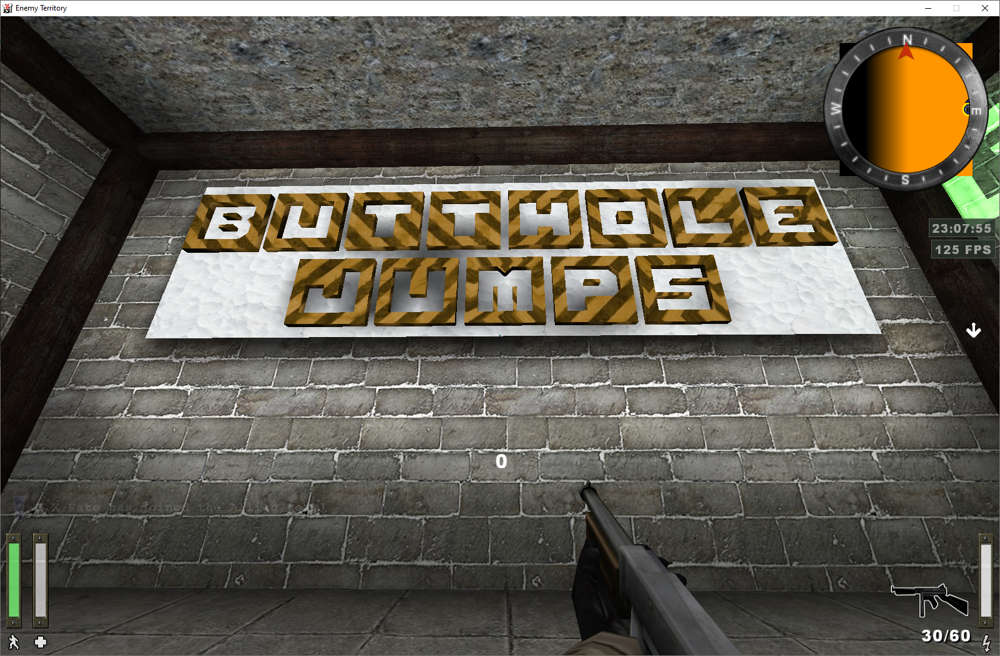
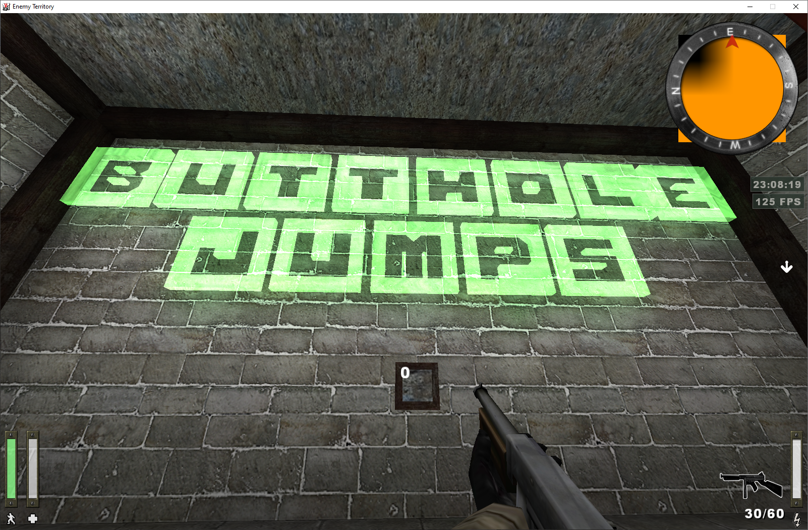

# Making letters (Blender)
1. Get [Blender](https://www.blender.org/download/)
2. Go ahead and open the Blender now, create a new General project.
3. Before we start, let's install the [export plugin](https://forums.duke4.net/index.php?app=core&module=attach&section=attach&attach_id=14459)
    - Unpack
    - In blender go to **Edit→References→Add-ons a**nd press the Install button,
    - **Find the file→Install Add-on** *(make sure it's checked in the list)*
    - To confirm you should see it under **File -> Export: MD3 (+shader)**
4. Delete everything in Scene Collection \

5. Press **Add** button on top right or **Shift + A** and select **Text**
6. Go to object data properties menu: green **a** symbol on right side menu.
    - **Paragraph section→Alignment: Horizontal and Vertical alignment to center**.
    - **Font section**→behind **Regular** press the folder box and find your font.
    - If you want 2D text (why?) then ignore this: **Geometry section→Extrude**
    - Hit **TAB** button to edit the text as you please.
    - Go to **Object mode**. Top right **Edit mode**→**Object mode**
    
7. **Right click** on screen: **Convert to mesh**
    - Under **Object Properties**, **Scale** section, pump it up like 40x \

8. Textures. Navigate to **Material Properties** menu, red ball thing on right side menu.
    - **New→Base Color→Image texture**. Click **Open** button under it, then and find your texture.
    - Change the material name to your texture / shader path. \
e.g. my model and texture will be in: *models/mapobjects/mymapname/letters* \
so my material name will be: *models/mapobjects/mymapname/letters/bl.jpg* \
If you want to use shader then something like: *models/mapobjects/mymapname/letters/myshadername* (no extension here) \

9. Go to **UV Editing** window, button on top bar.
    - On right side window press **a** to select everything then press **UV** button on top menu→**unwrap**
    - If you want to scale the texutre then on left side press **x**→**s** and move mouse to scale. \
    
10. Go back to **Layout** window, top menu.
    - **Modifier properties→Add modifier: Triangulate**
    - On bottom of the screen there is animation controls, set **End** to **1**

11. Make sure your object is selected, **File→Export→MD3 (+shaders)**

Results:

